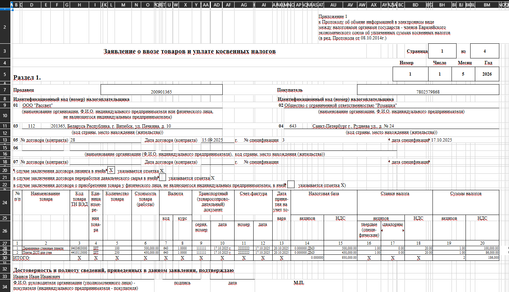
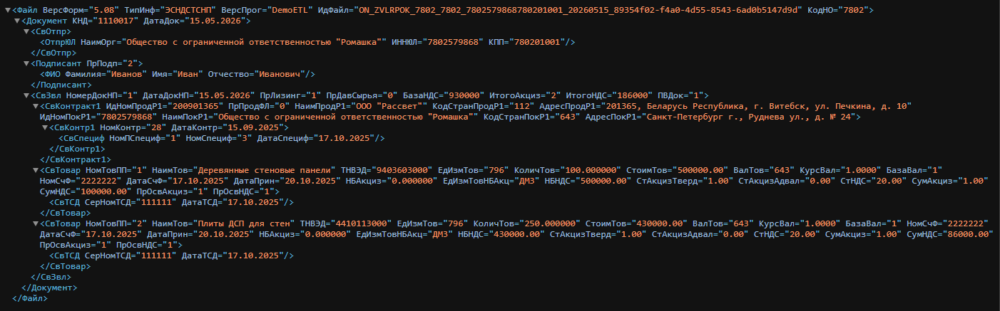

# DemoETL

Демонстрационный ETL pipeline для преобразования Excel-документов в XML-файлы, совместимые с XSD-схемами ФНС России.

Проект демонстрирует:

- конфигурируемое извлечение данных из Excel;
- определение типа документа;
- маппинг в доменные модели;
- enrichment/обогащение модели;
- генерацию XML;
- XSLT-трансформацию;
- XSD-валидацию.

---

# Возможности

- ETL pipeline: Excel → XML
- конфигурируемые правила extraction через JSON
- этап enrichment модели
- XSLT-трансформация
- XSD-валидация
- логирование
- single-file publish build

---

# Стек технологий

- .NET 10
- ClosedXML
- LINQ to XML
- XSLT
- XSD validation
- Microsoft.Extensions.Hosting / DI / Logging

---

# Структура репозитория

```text
.
├── Examples/          # примеры входных/выходных файлов
├── Screenshots/       # скриншоты
├── src/
│   └── DemoETL/       # исходный код
````

---

# Сборка проекта

Требуется:

* .NET SDK 10

Сборка:

```bash
dotnet build
```

---

# Запуск

Запуск из корня репозитория:

```bash
dotnet run --project .\src\DemoETL\DemoETL.csproj -- .\Examples\example.xlsx
```

---

# Publish build

Создание standalone executable:

```bash
dotnet publish .\src\DemoETL\DemoETL.csproj -c Release
```

Результат publish:

```text
src/DemoETL/bin/Release/net10.0/win-x64/publish/
```

Сгенерированный executable является self-contained и не требует установленного .NET Runtime на машине пользователя.

---

# Пример

Входной файл:

```text
Examples/example.xlsx
```

Результат:

```text
output/ON_ZVLRPOK_*.xml
```

---

# Скриншоты

## Входной Excel



## Сгенерированный XML



---

# Архитектура pipeline

```text
Excel
  ↓
Extraction
  ↓
Mapping
  ↓
Enrichment
  ↓
XML Builder
  ↓
XSLT Transformation
  ↓
XSD Validation
  ↓
Output XML
```

---

# Примечания

Проект является демонстрационным ETL-прототипом и намеренно упрощает часть интеграций:

* enrichment ОКЕИ реализован как заглушка;
* внешние сервисы отсутствуют;
* extraction-конфиги упрощены.

---

# Лицензия

MIT